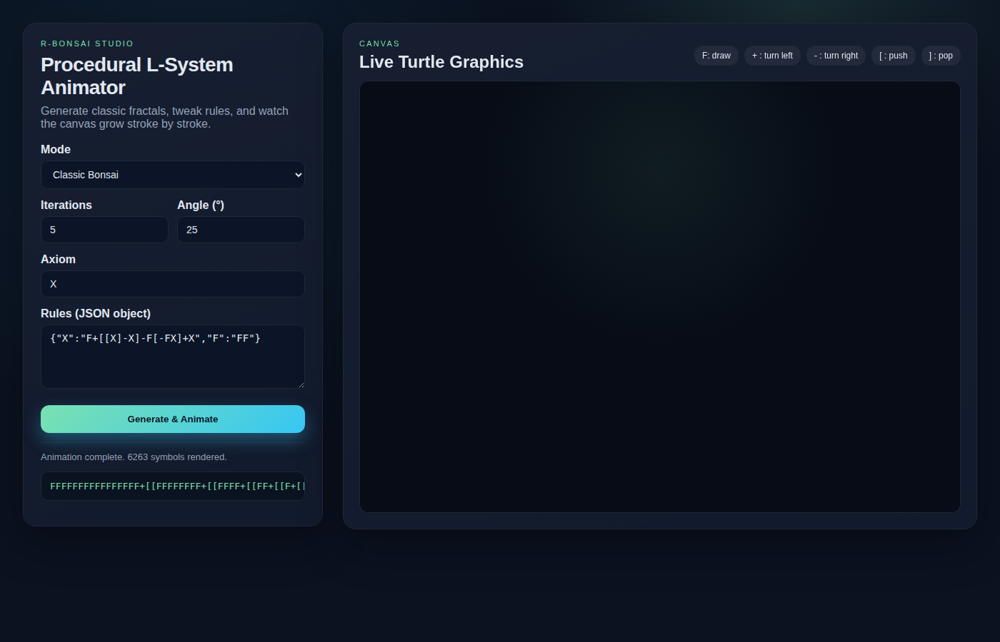
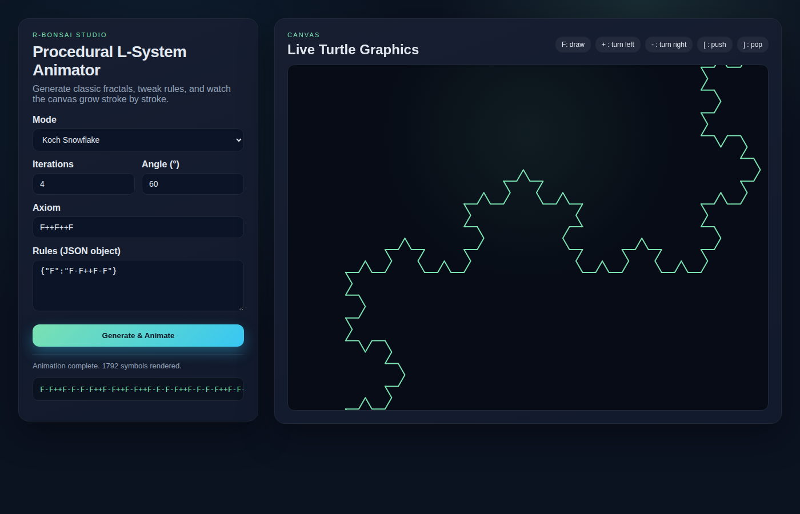

# R-Bonsai
FastAPI + Canvas playground for procedural L-systems (bonsai trees and Koch snowflake).

## Live demo
- GitHub Pages: https://raux.github.io/R-Bonsai/ (automatically published from `static/` via `.github/workflows/pages.yml`).

## Quick start
```bash
pip install -r requirements.txt
uvicorn app.main:app --reload
```

Open `http://127.0.0.1:8000/` to load the animator UI.

For a static preview (no backend required), open `static/index.html` directly or run:

```bash
python -m http.server 8000 --directory static
```

## Screenshots



## Tests
```bash
pytest
```
